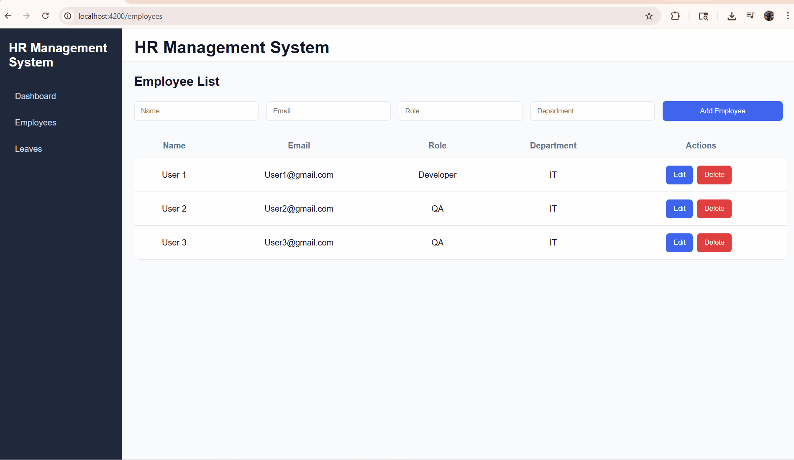

# 📊 HrManagementSystem (Angular + Signals)

This project was generated using Angular CLI version **21.1.3**.

A scalable and production-ready **Employee Management Dashboard** built using modern Angular features including **Signals**, **Reactive Forms**, and clean architecture principles. This application simulates real-world API interaction using a mock backend.

---

## 🚀 Features

* 👥 Employee List & Dashboard
* ➕ Add / ✏️ Edit / ❌ Delete Employees (CRUD)
* ✅ Reactive Forms with Advanced Validation
* 🔀 Routing & Navigation
* 🌐 API Integration (Mocked using json-server)
* ⚡ State Management using Angular Signals
* 🔄 Real-time UI updates (no manual subscriptions)
* 🧱 Clean & Scalable Folder Structure
* 🎯 Reusable Components
* ⚙️ Production-ready architecture

---

## 🆕 Modern Angular Highlights

* ⚡ Angular 21 (latest)
* ⚡ Signals API for state management
* 🔥 Optimized change detection
* 🚫 Reduced RxJS subscriptions
* 📦 Modular architecture

---

## 🛠️ Tech Stack

* **Frontend:** Angular 21, TypeScript
* **State Management:** Signals + RxJS
* **Forms:** Reactive Forms
* **Mock Backend:** json-server
* **Styling:** HTML5, CSS3

---

## 🌐 Mock API Setup (json-server)

### 📦 Install

```bash
npm install json-server
```

---

### ▶️ Run Mock Server

```bash
npx json-server --watch db.json
```

Default URL:

```
http://localhost:3000/employees
http://localhost:3000/Leaves

```

---

### 📄 Sample db.json

```json
{
  "employees": [
    {
      "id": 1,
      "name": "John Doe",
      "role": "Developer",
      "email": "john@example.com"
    }
  ]
}
```

---

### 🔗 API Endpoints

* GET `/employees`
* POST `/employees`
* PUT `/employees/:id`
* DELETE `/employees/:id`

---

## 📸 Screenshots

### 🏠 Overview
 

---

## 📂 Project Structure

```
src/
│── app/
│   ├── core/layout
│   ├── shared/
│   ├── features/
│   │   └── employee/
│   ├── state/
│   ├── app.routes.ts
│   └── main.ts
```

---

## ⚙️ Installation & Setup

```bash
# Clone repository
git clone https://github.com/your-username/your-repo-name.git

# Install dependencies
npm install

# Start mock server
npx json-server --watch db.json

# Run Angular app
ng serve
```

Open:

```
http://localhost:4200/
```

---

## 🔄 Application Flow

1. Angular app calls API (json-server)
2. Data stored in Signals-based state
3. Components consume signals
4. UI auto updates
5. CRUD operations reflect instantly

---

# ⚡ Angular CLI Default Commands

## Development server

To start a local development server, run:

```bash
ng serve
```

Then open:

```
http://localhost:4200/
```

---

## Code scaffolding

```bash
ng generate component component-name
```

For all options:

```bash
ng generate --help
```

---

## Building

```bash
ng build
```

Build output will be stored in `dist/`.

---

## Running unit tests

```bash
ng test
```

Uses **Vitest**.

---

## Running end-to-end tests

```bash
ng e2e
```

---

## 📌 Future Enhancements

* 🔐 Authentication & Authorization
* 📊 NgRx Signal Store
* 📱 Responsive UI
* 🌍 Deployment
* 📈 Dashboard analytics

---

## 🤝 Contributing

Feel free to fork and contribute 🚀

---

## 📄 License

MIT License

---

## ⭐ Interview Tip

👉 “I used Angular Signals for efficient state management and json-server to simulate real backend APIs, enabling full CRUD operations without a real backend.”

---

## 🔗 Additional Resources

* Angular CLI Docs: https://angular.dev/tools/cli
* json-server Docs: https://github.com/typicode/json-server
